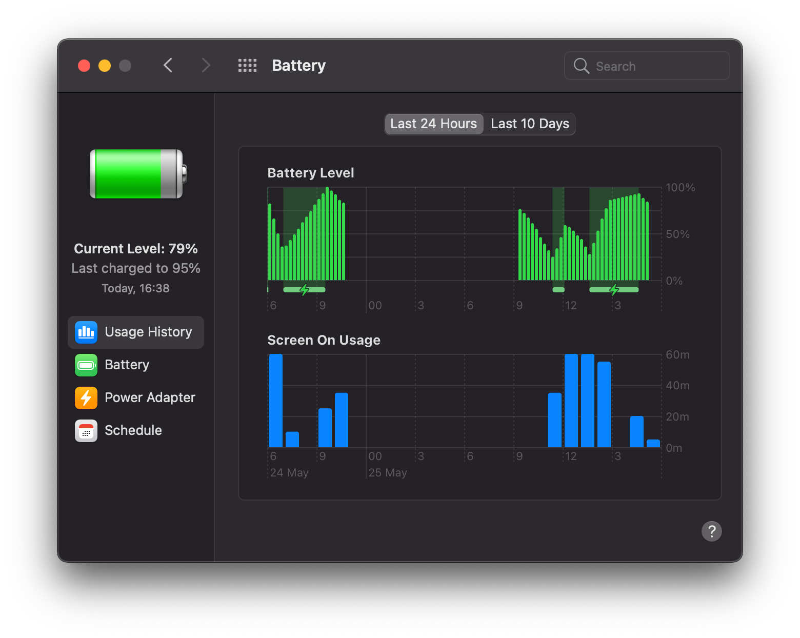
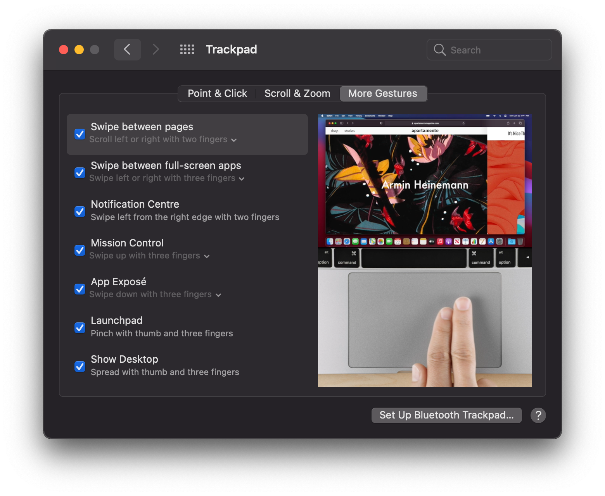
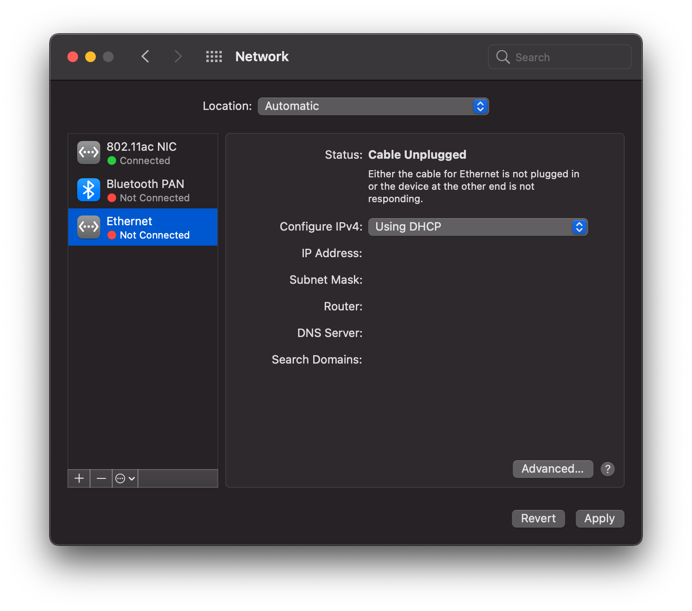

# Thinkbook13s-Hackintosh

### Supported Devices
> - **Lenovo Thinkbook13s**

### Current MacOs version
> - MacOs `12.0` Monterey

## Laptop Configuration

| Hardware    | info                                                      |
| ----------- | ------------------------------------------------------------ |                
| CPU         | Intel(R) Core(TM) i5-8265U（UHD Graphics 620）                |
| Memory      | DDR4 8GB 2400MHz                                             |
| DISK        | Kingston SA2000M8 250G                                       |
| Graphics    | UHD Graphics 620                                             |
| Monitor     | FHD 1920x1080                                                |
| Sound       | ACL 257                                                      |
| Trackpad    | Intel I2C HID INT34BB                                        |

## What doesn't work
| Status | Name                 | info                                                         |
| :----: | -------------------- | ------------------------------------------------------------ |
|   ❌    | Fingerprint          | USB custom blocked                                           |

## Some Screenshots

